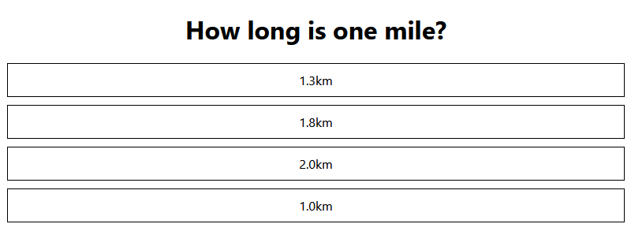

[](https://classroom.github.com/a/eQHMeEY-)
# Web Frameworks Week Exercise 1

## Introduction

In this exercise, you will practice and demonstrate your skills in React by creating a simple questionnaire application. The focus will be on understanding and implementing React components, passing data via props, and structuring your application logically.

## Task Summary

You will create a React application that displays a question with multiple answer options. This exercise will help you understand how to:

- Define and render React components.
- Pass data between components using props.
- Organize components in separate files.

## Step-by-Step Instructions

### 1. Set Up the Project

- Clone this project to your local machine.
- Install the dependencies with `npm install`.

### 2. Create the App Component

- The `App` component will serve as the root component of your application. It should render the `Question` component. The App component should receive the question and options as props. The props are named `question` and `options`. The question prop is a string and the options prop is an array of strings.

### 3. Create the Question Component

- Define a `Question` component in a separate file (`src/components/Question.js`).
- This component should receive `question` and `options` as props and render them.

### 4. Create the Option Component

- Define an `Option` component in a separate file (`src/components/Option.js`).
- The `Option` component should receive an individual option as a string prop and render it within a styled `div`.

### 5. Pass Props and Render Components

- Pass the `question` and `options` props from the `App` component to the `Question` component.
- In the `Question` component, process the `options` array and render each `Option` component.

### Expected Output

Your final DOM structure should look like this:

```
<div class="App">
  <div class="question">
    <h1>What is the capital of Italy?</h1>
    <div class="option">Turin</div>
    <div class="option">Milan</div>
    <div class="option">Rome</div>
  </div>
</div>
```

The outcome should look like in the example image below:


Notice that you must implement the DOM structure using react components. You are not allowed to
create the DOM structure in the App component. The App component should only render the question component
and the question component should render the question text and the options via option component.

## Testing Your Work

Run `npm run test` to validate your implementation.
Ensure all tests pass before committing your code.

## Submitting Your Work

Commit your changes and push them to your GitHub Classroom repository. The github classroom will run the same tests when you commit and push to your exercise repository. Make sure all tests pass locally on your own machine before submitting your work. Do not leave any debugging code in your final submission. Do not leave the submission to the last minute before deadline. Make sure you have plenty of time to submit your work.

## Useful Scripts

In the project directory, you can run:

`npm run dev`: Starts the development server.
`npm run test`: Runs the test suite to validate your code.
